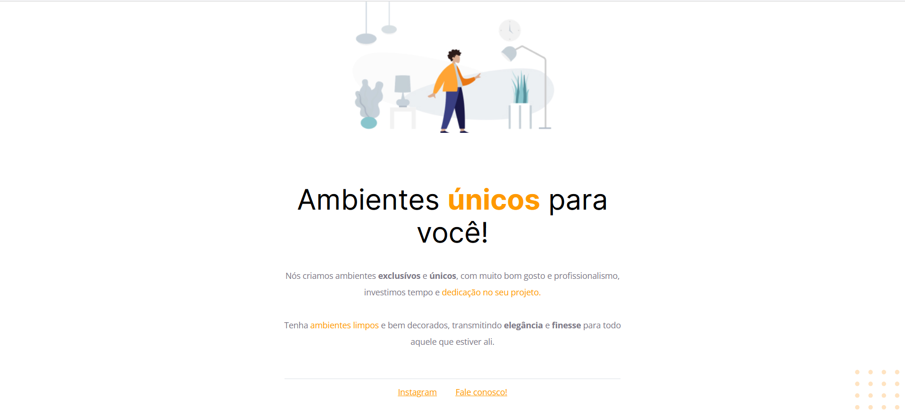

	<h1 align="center">Móveis Customizados</h1>
	
Aplicação desenvolvida no curso Explorer 3.0 da Rocketseat no Stage 2, na qual foi disponibilizado um design no figma.

<h3  align="center">
		✅ Status: concluído ✅
</h3>

## :page_facing_up: Conteúdo

- [Demonstração](#tv-demonstração)
- [Tecnologias](#hammer_and_wrench-tecnologias)

## :tv: Demonstração

  

## :hammer_and_wrench: Tecnologias

- [HTML](https://developer.mozilla.org/pt-BR/docs/Web/HTML)
- [CSS](https://developer.mozilla.org/pt-BR/docs/Web/CSS)

## 📕License

This project is under the [MIT](./LICENSE).
